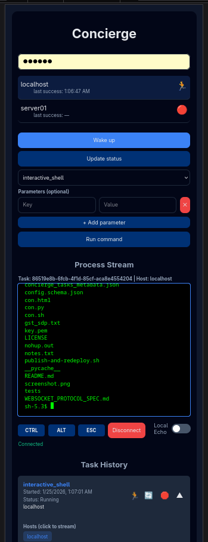

# concierge-acpi
Python static API key authenticated embedded SSL web service that sends WoL and
runs (ssh remote) commands (like pm-suspend, webcam, or interactive shell) on
allowed devices.

 - All standalone, no dependencies beyond python built-in libraries.

Includes a rudimentary mobile-first HTML frontend to optionally deploy for
testing and/or sending ad-hoc commands. Also self-contained: It runs in any
modern browser without external dependencies.

## Notes

Beware that, because of the self-imposed no external dependencies limitation,
support for VT100 escape codes in the embedded frontend is very limited. I have
no intention to write a full emulator, but it should be easy enough to plug one
like https://xtermjs.org/

The same goes for both frontend and API for camera streams: jpeg frame stream
only. It is not hard to hack an actual video stream like x264 with much better
quality and performance, but without WebRTC & signaling it is super laggy. If
plugging a third party dependency is not a problem,
[aiortc](https://github.com/aiortc/aiortc/tree/main/examples/webcam)
looks pretty neat.

Avoid storing sensitive data in persisted tasks: The persisted file is not
encrypted.

The task planner/plan scheduler and admin interface are an ongoing PoC to pair
in the future with a visual editor frontend a la Home Assistant. There are
still many bugs and functional spec nonsenses to address before they are
actually useful to define and schedule unsupervised task execution flows.

## Resources

 - [publish-and-redeploy.sh](publish-and-redeploy.sh)
 - [concierge_config.json.example](concierge_config.json.example)
 - [config.schema.json](config.schema.json)
 - [concierge-acpi_swagger-openapi-spec.yml](concierge-acpi_swagger-openapi-spec.yml)
 - [WEBSOCKET_PROTOCOL_SPEC.md](WEBSOCKET_PROTOCOL_SPEC.md)
 - [LICENSE](LICENSE)